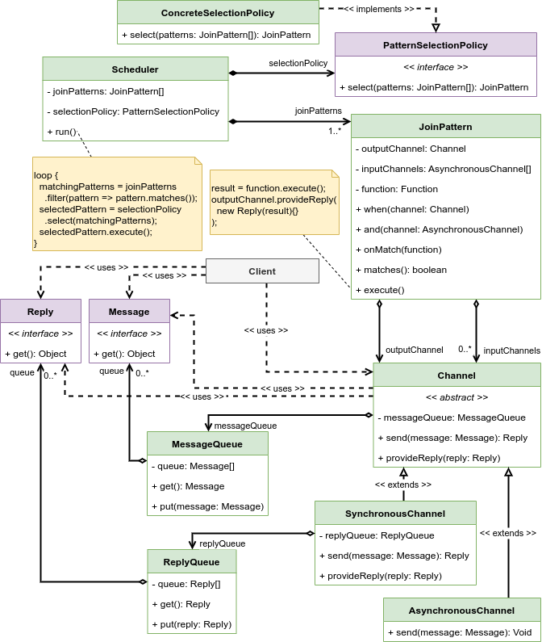

# Join calculus

Provide a way to abstract the complexity of concurrent environment and to allow scalability by focusing on execution of a chord between messages atomically consumed from a group of channels.

