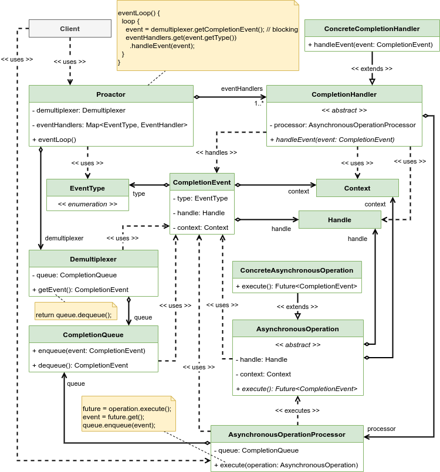

# Proactor

Allow event-driven applications to process requests in an efficient asynchronous way by splitting them into long-duration asynchronous operations and completion handlers that process the results of the associated operations.

