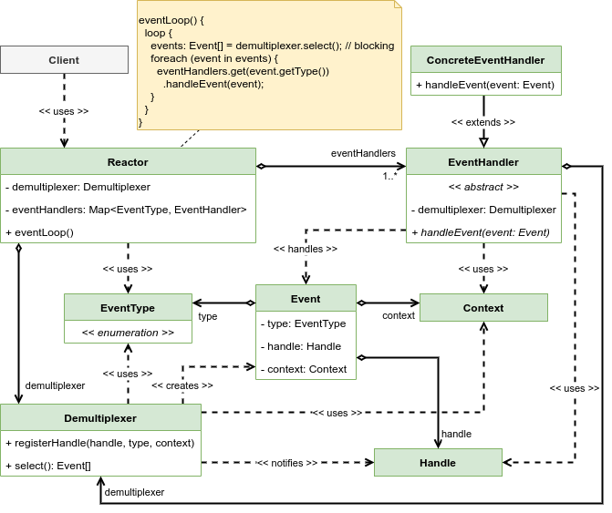

# Reactor

Process requests received concurrently from one or more inputs by a service that demultiplexes the incoming requests and dispatches them synchronously to the associated request handlers.

